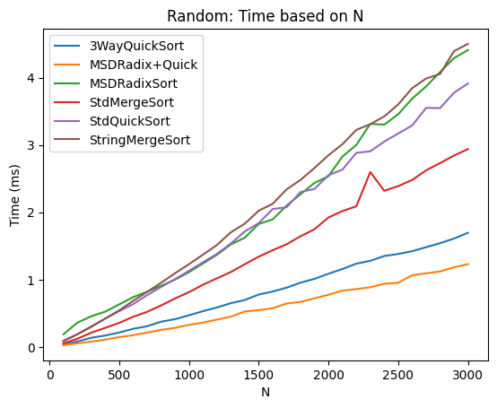
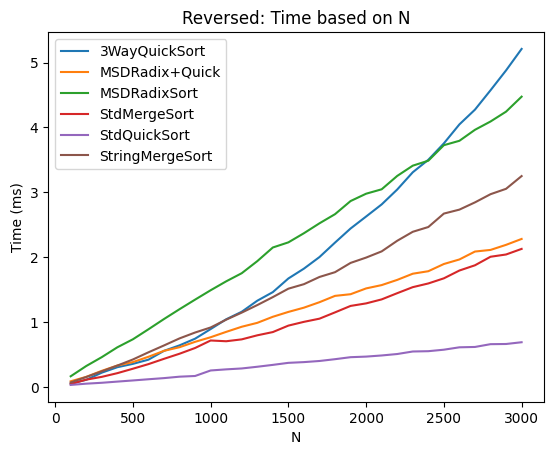
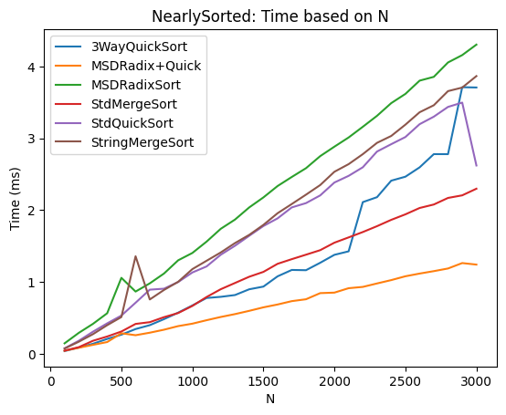
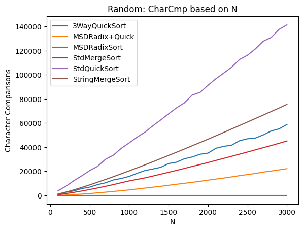
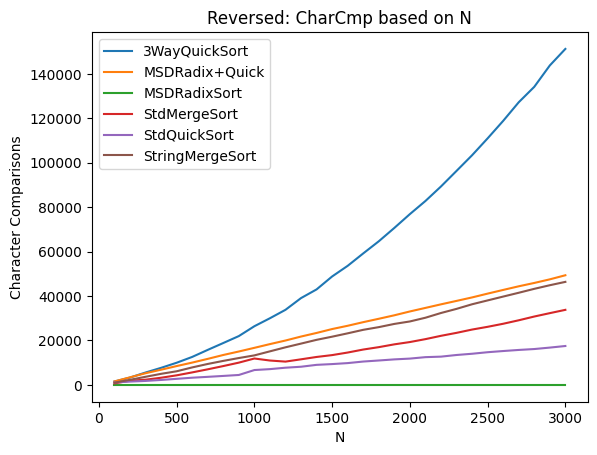
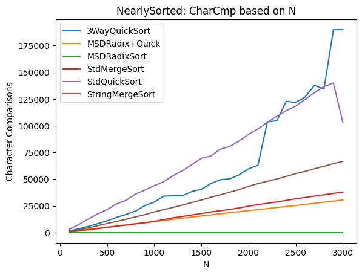

# Отчёт по эмпирическому исследованию алгоритмов сортировки строк

---

## 1. Цели исследования

- Сравнить стандартные алгоритмы сортировки строк (`std::sort`, `std::stable_sort`)  
  с адаптированными методами:
    - Ternar String QuickSort
    - String MergeSort с LCP-оптимизацией
    - MSD-radix sort (с переключением на QuickSort и без)
- Измерить два показателя:
    1. **Время выполнения** (ms)
    2. **Число посимвольных сравнений**
- Проанализировать результаты на трёх типах входных данных:
    - **Random** (случайно сгенерированный массив)
    - **Reversed** (обратно отсортированный)
    - **NearlySorted** (почти отсортированный, +100 случайных свапов)

---

## 2. Методология

### 2.1 Генерация данных

- **Алфавит:** 74 символа (A–Z, a–z, 0–9, `!@#%:;^&*()-`)
- **Длина каждой строки:** от 10 до 200 символов
- **Размер массива:** N = 100, 200, …, 3000

Три состояния:
1. **Random**: массив целиком случайный
2. **Reversed**: лексикографически отсортированный и затем обращённый
3. **NearlySorted**: полностью отсортированный плюс 100 случайных перестановок

### 2.2 Алгоритмы

| Аббревиатура         | Описание                                                         |
|----------------------|------------------------------------------------------------------|
| **StdQuickSort**     | `std::sort` (Introsort)                                          |
| **StdMergeSort**     | `std::stable_sort`                                               |
| **3WayQuickSort**    | Ternar string QuickSort                                          |
| **StringMergeSort**  | MergeSort с LCP-оптимизацией (пропуск общих префиксов)           |
| **MSDRadixSort**     | MSD-radix sort (без переключения)                                |
| **MSDRadix+Quick**   | MSD-radix + переключение на 3-way QuickSort при подмассивах < 74 |

### 2.3 Измерения

- **Время:** среднее по 5 независимым прогонкам
- **Псимвольные сравнения:** среднее по 5 прогонкам
- Данные сохраняются в CSV и визуализируются скриптами Python.

---

## 3. Результаты

### 3.1 Время выполнения

#### 3.1.1 Random: Time vs N

- **MSDRadix+Quick** показывает наилучшую производительность (линейный рост, меньший накладной коэффициент).
- **StdQuickSort** и **3WayQuickSort** медленнее всех из-за повторных сравнений и рекурсий.
- **StringMergeSort** и **StdMergeSort** близки, но LCP-вычисления немного замедляют.

#### 3.1.2 Reversed: Time vs N

- **MSDRadixSort** и **MSDRadix+Quick** стабильно линейны и не чувствительны к порядку элементов.
- **StdQuickSort** показывает небольшую деградацию, но Introsort сохраняет баланс.
- **3WayQuickSort** чуть медленнее из-за частого переключения глубины.

#### 3.1.3 NearlySorted: Time vs N

- **MSDRadix+Quick** всё ещё лидирует.
- **3WayQuickSort** демонстрирует «ступенчатый» профиль: переключения между radix и QuickSort.
- **StringMergeSort** и **StdMergeSort** сохраняют схожий рост, LCP даёт небольшие накладные расходы.

---

### 3.2 Посимвольные сравнения

#### 3.2.1 Random: CharCmp vs N

- **StdQuickSort** генерирует наибольшее число сравнений: ~O(N log N) с большим коэффициентом.
- **StringMergeSort** и **StdMergeSort** меньше, но также O(N log N).
- **3WayQuickSort** экономит до 20 % сравнений.
- **MSDRadixSort** – 0 сравнений (не использует сравнения символов).
- **MSDRadix+Quick** – лишь небольшое линейное число сравнений на маленьких сегментах.

#### 3.2.2 Reversed: CharCmp vs N

- **3WayQuickSort** заметно выигрывает у StdQuickSort по числу сравнений на обратном порядке.
- **MSDRadix+Quick** и **StringMergeSort** – сублинейные и стабильные.

#### 3.2.3 NearlySorted: CharCmp vs N

- **StdQuickSort**/**StdMergeSort** – средние результаты.
- **3WayQuickSort** – «ступенчатый» характер из-за порога переключения.
- **StringMergeSort** – ровно линейный рост сравнений.
- **MSDRadix+Quick** – минимальное число сравнений среди алгоритмов, выполняющих сравнения.

---

## 4. Анализ

1. **Чистый MSD-radix** избавлен от сравнений символов, но теряет в абсолютном времени из-за накладных копирований.
2. **MSDRadix+Quick** удачно сочетает линейную основу с эффективной сортировкой малых групп QuickSort’ом, стабильно лидирует по времени.
3. **3-way QuickSort** снижает число сравнений, но чувствителен к особенностям данных (частые одинаковые префиксы).
4. **StringMergeSort** уменьшает сравнения по сравнению со стандартным MergeSort, но LCP-расчёты добавляют константные затраты.
5. **Стандартные алгоритмы** (`std::sort`, `std::stable_sort`) остаются неплохими «универсалами», но не оптимальны для длинных строк.

---

## 5. Рекомендации

- **Для больших массивов строк**: использовать **MSDRadix+Quick**.
- **Для минимизации сравнений** (при невысокой важности абсолютного времени): `3WayQuickSort` или `StringMergeSort`.
- **Для небольших N** (< 500): `std::sort` вполне конкурентоспособен.

---

## 6. Исходники и графики

- **Код генерации и тестирования**: `StringGenerator.cpp`, `StringSortTester.cpp`, `*.cpp/.h` файлы сортировок.
- **Репозиторий** с данными и скриптами:  
  https://github.com/RaikyD/AlgosSet9

